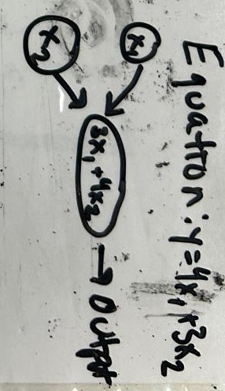
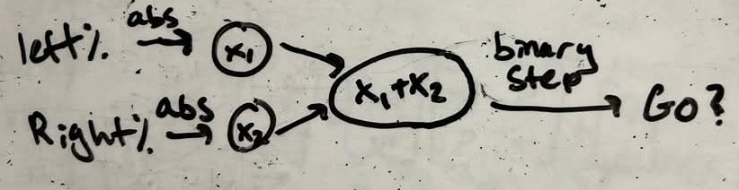

# OR Controlled Car

## Goal

Build your car now to be controlled by the joystick using an OR gate:
- Either or both joysticks being active moves the car forwards at a default speed
- Both joysticks being inactive means the car does not move

Use these function to determine if your joysticks are active, and use them as the inputs to your network:
```python
# Usage: is_active_left(c)
def is_active_left(controller):
    return controller.sensor.leftPercent > 5 or controller.sensor.leftPercent < -5

#Usage: is_active_right(c)
def is_active_right(controller):
    return controller.sensor.rightPercent > 5 or controller.sensor.rightPercent < -5
```

**Challenge:** Try drawing your diagram just like you did for the last activity before writing the program. What are the input(s) and output(s)? What is an equation that gets you from inputs to outputs? You might need to use something called an activation function, so look at the tips for help. 

Then, you can use your diagram to write your code as an equation rather than using the built in logical operators.

## Tips
<details>
<summary>Read tips</summary>

- Draw your diagram, see if a structure like this helps:


- You might find that you cannot get the output numbers exactly where you want them to be for a binary output, try using an **activation function** after your linear equation, something that alters the output of your linear equation in a non-linear way. A couple examples of activation functions you can try:
    - ReLU: any number below 0 becomes 0, other numbers stay their value
        ```python
        def ReLU(x):
            if x < 0:
                return 0
            else:
                return x
        ```
    - Binary Step: Anything over 0 becomes 1, anything less than or equal to 0 becomes 0
        ```python
        def binary_step(x):
            if x <= 0:
                return 0
            else:
                return 1
        ```

</details>

<details>
<summary>Example Code Solution</summary>

```python
import lelib
from lelib import controller, doubleMotor
import time
c = controller()
dm = doubleMotor()

c.connect(card_serial="1131")
dm.connect(card_serial="1131")

def is_active_left(controller):
    return controller.sensor.leftPercent > 5 or controller.sensor.leftPercent < -5

def is_active_right(controller):
    return controller.sensor.rightPercent > 5 or controller.sensor.rightPercent < -5

def binary_step(x):
    if x <= 0:
        return 0
    else:
        return 1

def layer(x1, x2):
    return (x1 + x2)

def predict(x1, x2):
    return (binary_step(layer(x1, x2)))

while True:
    go = predict(int(is_active_left(c)), int(is_active_right(c)))
    if go == 1:
        print("going")
        dm.run()
    else:
        print("stopping")
        dm.stop()
    time.sleep(0.5)
```

</details>

## Modeling the Equation

Look at the tips for some help drawing your diagram if you haven't already.

Think about why the activation function was useful, and why neural networks might need these in addition to the linear layers.

<details>
<summary>Example Diagram Solution</summary>


</details>
