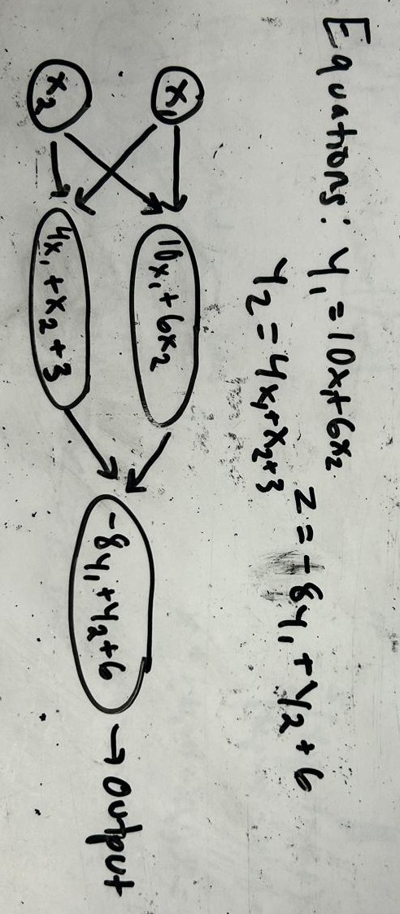
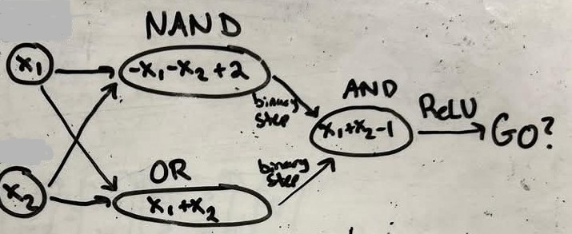
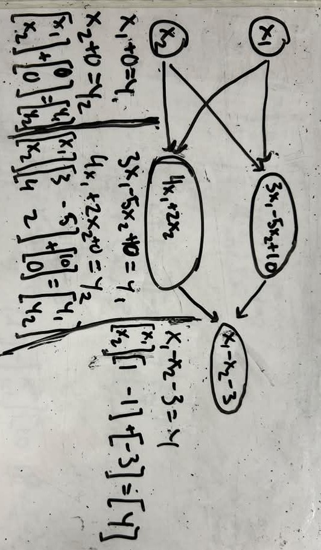

# XOR Controlled Car

## Goal

Now, do the same as the last activity, but instead of using an OR gate, use an XOR (exclusive or). So:
- Either of the joysticks being active drives the car at the default speed
- Both of the joysticks being active does not move the car
- Both the joysticks being inactive does not move the car

Use these function to determine if your joysticks are active, and use them as the inputs to your network:
```python
def is_active_left(controller):
    return controller.sensor.leftPercent > 5 or controller.sensor.leftPercent < -5

def is_active_right(controller):
    return controller.sensor.rightPercent > 5 or controller.sensor.rightPercent < -5
```

Again, try drawing your diagram before diving into the coding, and think about how you can use activation functions. See tips for some hints.

## Tips

<details>
<summary>Read Tips</summary>

- You might have trouble modeling this problem with just one equation, so think about how you can break it into smaller problems, each with their own equation
    - Bonus hint: In particular, can you describe XOR in terms of two simpler logic gates? (Try looking up NAND...)
- How would you draw your diagram now that you broke it down some? Think about the flow of inputs to outputs, and add some extra circles if you need to. Think about this kind of structure as an example:


</details>

<details>
<summary>Example Code Solution</summary>

```python
import lelib
from lelib import controller, doubleMotor
import time
c = controller()
dm = doubleMotor()

c.connect(card_serial="1131")
dm.connect(card_serial="1131")
def is_active_left(controller):
    return controller.sensor.leftPercent > 5 or controller.sensor.leftPercent < -5

def is_active_right(controller):
    return controller.sensor.rightPercent > 5 or controller.sensor.rightPercent < -5

def binary_step(x):
    if x <= 0:
        return 0
    else:
        return 1
    
def ReLU(x):
    if x < 0:
        return 0
    else:
        return x

def layer1_1(x1, x2):
    return -x1 - x2 + 2

def layer1_2(x1, x2):
    return x1 + x2

def layer2(x1, x2):
    return x1 + x2 - 1

def predict(x1, x2):
    out1 = binary_step(layer1_1(x1, x2))
    out2 = binary_step(layer1_2(x1, x2))
    out = ReLU(layer2(out1, out2))
    return out

while True:
    go = predict(int(is_active_left(c)), int(is_active_right(c)))
    if go == 1:
        print("going")
        dm.run()
    else:
        print("stopping")
        dm.stop()
```

</details>

## The Diagram
<details>
<summary>Solution</summary>

Hopefully, you got a diagram that looks something like this:



</details>

## Turning it into a Matrix
This is just like a real neural network: it has a linear input layer, a linear hidden layer, and a linear output layer, and uses activation functions to handle non-linearity.

Also, pay attention to the flow of information. Every node in an input layer connects to every node in it's output layer, that allows to to represent this in matricies. Try turning this network a series of matrix equations: y = Wx + b. (If you need a quick intro to matrix multiplication, play around with this calculator: http://matrixmultiplication.xyz/). For example, we could translate a diagram like this as so:



Being able to write every neurons equation in a layer as just one matrix makes life much simpler for us when programming how to use those equations.

**Challenge**: Try writing your XOR diagram as a series of equations with weight matrices and bias vectors. 
