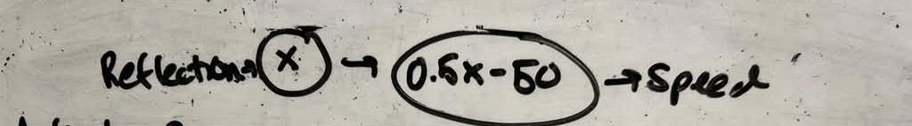

# Slow to the Wall
## Goal
Using a double motor and a color sensor, build a car (keep it simple), and write a program to make it slow down as it reaches a white wall.

Feel free to look at the tips, and when you are done, continue to modeling the equation.

## Tips
<details>
<summary>Read tips</summary>

- Try using the color sensor's reflection value. What should your relationship be between the speed of the car and the relfection value of the color sensor?
- Is your speed too fast or too slow? How can you scale it?

</details>

## Modeling the Equation
<details>
<summary>Read modeling instructions</summary>

Now you have built a car, with your speed depending on the color sensor value. Maybe you scaled your speed to have:
```python
speed = 0.5 * (100 - reflection)
```
or, expanding, we get
```python
speed = 50 - 0.5 * reflection
```
Try drawing this in a diagram: represent your input(s) and output(s) with circles, and draw arrow(s) from each input(s) to each output(s), with equation(s) for how to get from one to the other.

<details>
<summary>Example Diagram Solution</summary>


</details>

</details>